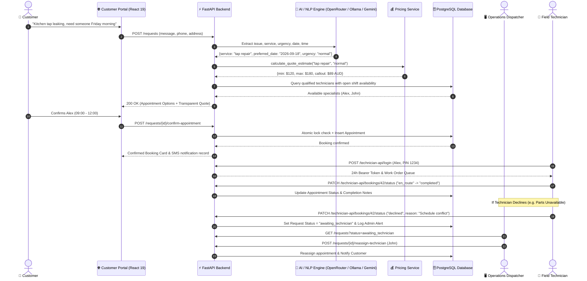

# FlowFix AI — Autonomous Plumbing Dispatch & Operations Platform

[](https://fastapi.tiangolo.com/)
[](https://react.dev/)
[](https://mui.com/)
[](https://vitejs.dev/)
[](https://www.postgresql.org/)
[](https://ollama.ai/)
[](https://openrouter.ai/)
[](https://python.org/)
[](https://pytest.org/)

**FlowFix AI** is an enterprise-grade, full-stack field service management platform connecting three synchronized operational experiences:
1. **Intelligent Customer Intake Agent** (Self-serve conversational diagnosis, automated skill matching, transparent quote estimation, and real-time slot selection).
2. **Operations Dispatch Command Center** (Live fleet capacity, SLA monitors, interactive reassignment & booking drawer, and autonomous AI copilot).
3. **Mobile-First Field Technician Portal** (PIN-authenticated work orders, job lifecycle transitions, decline-and-redispatch routing, customer calling, and navigation).

---

## System Architecture & Tri-Party Data Flow



---

## Core Capabilities & Features

### 1. Conversational Customer Self-Serve Intake
- **Natural Language Diagnosis**: Customers describe plumbing problems in free text (*"my kitchen mixer tap is dripping constantly"*, *"no hot water from the tank"*, or *"water flooding from burst pipe"*).
- **Certified Trade Category Resolution**: Normalizes messy customer input into 10 industry-standard plumbing specializations:
  - `tap repair`, `toilet repair`, `shower repair`, `leak investigation`
  - `blocked drains`, `hot water system`, `burst pipe repair`
  - `gas fitting`, `roof plumbing`, `backflow prevention`
- **Transparent Upfront Quote Estimation**: Dynamically calculates transparent pricing breakdowns (trade base range, callout fee, urgency surcharges) shown directly before booking confirmation.
- **Deterministic & LLM Date/Time Math**: Resolves relative calendar language (*"tomorrow morning"*, *"Friday 18 Sept"*, *"asap"*, *"first available slot"*) into strict ISO timestamps without hallucinated drift.
- **Loop-Proof Clarification**: When details are missing, asks concise follow-up questions without getting trapped in conversational loops.
- **Collision-Proof Slot Selection**: Generates certified technician appointment options filtered by specialty and real-time calendar availability.

### 2. Operations Command Center (Dispatcher Dashboard)
- **Fleet Workload Monitor**: Live capacity indicators showing shift utilization percentages, active job allocations, and license status.
- **Direct Admin Booking Drawer**: Dispatchers can inspect any service request, view real-time qualified specialist availability, filter by trade capability and shift window (morning / afternoon), and book or reschedule appointments with race condition protection.
- **Awaiting Technician & Re-Dispatch Queue**: Prominently highlights jobs requiring reassignment (e.g., when a field technician declines a work order), showing technician names alongside IDs for instant redeployment.
- **Onboard Field Specialists**: Interactive technician registration modal with:
  - Multi-select certified capabilities across all 10 licensed plumbing trade domains.
  - **Automated 35-Day Shift Provisioning**: Automatically seeds 70 morning (`09:00–12:00`) and afternoon (`13:00–17:00`) slots across rolling 5 weeks upon registration.
  - Live grid reload without page refreshes.
- **Request Lifecycle Management**: Full pipeline visibility through `received`, `awaiting_information`, `awaiting_appointment_selection`, `awaiting_technician`, `confirmed`, and `no_availability`.

### 3. Mobile-First Field Technician Portal
- **PIN Authentication & Demo Switcher**: Fast, secure mobile sign-in using technician name/ID and PIN (`1234`), featuring an instant technician switcher for seamless evaluation of multiple fleet members.
- **"Up Next" Work Order Hero**: High-visibility card highlighting the active job with urgency badges, arrival window countdown, customer contact details, and job description.
- **Direct Action Triggers**:
  - **One-Tap Phone Call**: Initiates immediate phone call (`tel:`) to customer.
  - **GPS Navigation**: Launches Google Maps turn-by-turn navigation directly to job address.
- **Work Order Status Progression**: Step-by-step progress buttons:
  - `Accept Job` ➔ `En Route` ➔ `In Progress` ➔ `Complete Work Order`
- **Audited Job Decline Flow**: Technicians can decline with pre-categorized reasons (*Schedule Conflict*, *Outside Service Area*, *Specialized Parts Unavailable*, *Emergency*, or custom notes), instantly re-routing the request to `awaiting_technician` and raising a high-priority dispatcher alert.
- **Service Completion Notes**: Prompts technician for work notes and findings upon completion.
- **35-Day Shift Schedule Inspector**: Displays rolling morning and afternoon shift allocations for upcoming weeks.

### 4. Dynamic Tiered Pricing Engine
FlowFix includes a transparent pricing estimation service ([`app/services/pricing_service.py`](file:///Users/shivam/Desktop/flowfix-agent%20copy/app/services/pricing_service.py)) calibrated to standard Australian trade rates:

| Plumbing Trade Domain | Complexity | Base Estimate (AUD) | Typical Duration |
| :--- | :--- | :--- | :--- |
| **Tap Repair** | Standard | $120 – $180 | 1.5 hrs |
| **Toilet Repair** | Standard | $140 – $220 | 1.5 hrs |
| **Shower Repair** | Standard | $150 – $240 | 2.0 hrs |
| **Leak Investigation** | Intermediate | $180 – $320 | 2.0 hrs |
| **Blocked Drains** | Intermediate | $190 – $350 | 2.0 hrs |
| **Hot Water System** | Advanced | $280 – $650 | 3.0 hrs |
| **Burst Pipe Repair** | Critical / Emergency | $320 – $750 | 3.0 hrs |
| **Gas Fitting** | Licensed Specialist | $220 – $480 | 2.5 hrs |
| **Roof Plumbing** | Licensed Specialist | $250 – $550 | 3.0 hrs |
| **Backflow Prevention** | Certified Specialist | $200 – $420 | 2.0 hrs |

- **Callout Fee**: Standard $89 AUD callout applied to transparent breakdowns.
- **High Urgency Surcharge**: $80 AUD emergency dispatch surcharge automatically factored into estimates for high-priority requests.

### 5. Autonomous Dispatcher Copilot (Agent Studio)
- Natural language operations assistant capable of executing administrative actions:
  - Querying fleet capacity and unassigned workloads.
  - Reallocating emergency appointments.
  - Inspecting job histories and customer profiles.
  - Multi-provider AI backing: **OpenRouter** (e.g. `meta-llama/llama-3.3-70b-instruct:free`, `google/gemini-2.0-flash-exp:free`), local **Ollama** (`qwen2.5:3b`), or **Google Gemini**.

### 6. Concurrency & Reliability Hardening
- **Race Condition Prevention**: Prevents double-booking through database transaction isolation and slot validation at commit time.
- **Stale Booking Rejection**: If two customers select the same slot concurrently, the second confirmation is rejected cleanly with an atomic rollback.
- **Global Error Boundaries**: Client-side React error boundaries prevent white-screen crashes and offer instant recovery.

---

## Tech Stack

| Layer | Technologies |
| :--- | :--- |
| **Backend API** | **Python 3.11+**, **FastAPI**, **SQLAlchemy 2.0**, **PostgreSQL** (`psycopg3`), **Pydantic v2**, **Alembic** |
| **AI / NLP** | **OpenRouter** (Cloud LLMs), **Ollama** (`qwen2.5:3b`), **Google Gemini** (`google-genai`), Deterministic Weekday/Month Engine |
| **Frontend** | **React 19.2**, **Vite 8.2**, **Material-UI v9.3**, **Emotion**, **React Router 7**, **Framer Motion** |
| **Design Systems** | Custom Sapphire & Slate Admin Theme + Dedicated Dark Emerald & Amber Field Technician Theme |
| **Infrastructure** | **Docker Compose** (PostgreSQL 17), JWT Bearer Security, Role-Based Access Control (`operations`, `admin`, `tech`) |
| **Testing** | **Pytest 9** (59 unit & integration tests covering NLP, Pricing, Technician Portal, Booking, Concurrency, and Security) |

---

## Project Structure

```text
flowfix-platform/
├── app/                            # FastAPI Backend Application
│   ├── agent/                      # Autonomous Operations Dispatcher Copilot
│   ├── api/                        # REST API Endpoints
│   │   ├── admin.py                # Admin user management & settings
│   │   ├── appointments.py         # Appointment scheduling & calendar queries
│   │   ├── auth.py                 # JWT login & token exchange
│   │   ├── customers.py            # Customer CRM & request histories
│   │   ├── dashboard.py            # KPI metrics & notification center
│   │   ├── requests.py             # Customer request intake, extraction & booking
│   │   ├── technician_portal.py    # Field Technician mobile API (PIN auth, jobs, transitions)
│   │   └── technicians.py          # Fleet management & skill catalog
│   ├── auth/                       # Security, password hashing (bcrypt), RBAC dependencies
│   ├── services/                   # Domain Logic Services
│   │   ├── appointment_service.py  # Slot reservation logic
│   │   ├── confirmation_service.py # Atomic booking confirmation & collision rollback
│   │   ├── extraction_service.py   # Intent & entity extraction orchestrator
│   │   ├── llm_provider.py         # OpenRouter / Ollama / Gemini provider abstraction
│   │   ├── pricing_service.py      # Transparent quote & tier calculation engine
│   │   ├── scheduling_service.py   # Availability slot discovery & qualification matching
│   │   └── validation_service.py   # Deterministic date/time parsing engine
│   ├── database.py                 # SQLAlchemy Session & Engine Configuration
│   ├── main.py                     # FastAPI application setup & lifespan auto-migration
│   ├── models.py                   # Pydantic schemas & DTOs
│   ├── models_db.py                # SQLAlchemy declarative database models
│   ├── seed.py                     # Unified seeder entrypoint
│   ├── seed_availability.py        # 35-day rolling shift availability seeder
│   ├── seed_services.py            # 10 certified plumbing trades seeder
│   ├── seed_showcase.py            # Realistic demo requests, appointments & customers
│   └── seed_technicians.py         # Field specialists with skills, phones & PINs
├── frontend/                       # React 19 + Material-UI Frontend
│   ├── src/
│   │   ├── components/             # Reusable UI (Sidebar, PageHeader, StatusChip, ErrorBoundary)
│   │   ├── customer/               # Customer Intake Portal Flow
│   │   │   ├── CustomerPortal.jsx  # Multi-step intake flow with transparent quote display
│   │   │   └── components/         # Stepper components (AppointmentStep, ConfirmationStep)
│   │   ├── pages/                  # Application Views
│   │   │   ├── Overview.jsx        # Fleet capacity & KPI overview
│   │   │   ├── Requests.jsx        # Request pipeline & re-dispatch drawer
│   │   │   ├── Appointments.jsx    # Calendar/table schedule view with quote breakdowns
│   │   │   ├── Technicians.jsx     # Fleet management & technician onboarding modal
│   │   │   ├── Customers.jsx       # Customer CRM & past service histories
│   │   │   ├── Agent.jsx           # Autonomous Dispatcher Copilot (Chat & Tool execution)
│   │   │   ├── Settings.jsx        # Admin user accounts & LLM provider configurations
│   │   │   ├── Login.jsx           # Operations/Admin login page
│   │   │   ├── TechnicianLogin.jsx # Mobile-first technician PIN authentication & demo switcher
│   │   │   └── TechnicianPortal.jsx# Field technician work order queue, navigation & transitions
│   │   ├── services/               # API client functions (Axios / Fetch)
│   │   └── theme/                  # Design Systems (theme.js & technicianTheme.js)
│   └── package.json
├── tests/                          # 59 Automated Tests Across 11 Modules
│   ├── test_admin_booking.py       # Admin booking drawer & options tests
│   ├── test_auth_and_admin.py      # Authentication & RBAC permissions tests
│   ├── test_confirmation_and_transactions.py # Concurrency & double-booking safety
│   ├── test_database_and_customers.py        # Customer CRUD & agent search
│   ├── test_extraction_and_nlp.py  # NLP extraction, trade classification & date math
│   ├── test_llm.py                 # LLM provider integration tests
│   ├── test_openrouter.py          # OpenRouter cloud LLM mock & fallback tests
│   ├── test_pricing.py             # Transparent quote estimation engine tests
│   ├── test_scheduling_and_dispatch.py       # Specialist qualification & slot matching
│   ├── test_technician_portal.py   # PIN login, status progression & decline workflow
│   └── test_technicians_and_skills.py        # Specialist creation & auto-shift seeding
├── alembic/                        # Database migration scripts
├── compose.yaml                    # PostgreSQL 17 Docker Compose Configuration
├── package.json                    # Root proxy scripts (`npm run dev` / `npm run build`)
├── requirements.txt                # Python backend dependencies
└── .env.example                    # Environment variable configuration template
```

---

## Quickstart Guide

### 1. Prerequisites
- **Python 3.11+**
- **Node.js 18+** & **npm**
- **Docker & Docker Compose** (for PostgreSQL)
- *(Optional)* **OpenRouter API Key** for cloud LLM inference
- *(Optional)* **Ollama** running `qwen2.5:3b` for local offline LLM inference

### 2. Clone & Environment Setup
```bash
git clone https://github.com/your-username/flowfix-platform.git
cd flowfix-platform

# Copy environment template
cp .env.example .env
```

### 3. Start PostgreSQL Database
```bash
docker compose up -d
```

### 4. Setup Python Virtual Environment & Install Dependencies
```bash
python3 -m venv .venv
source .venv/bin/activate
pip install -r requirements.txt
```

### 5. Run Migrations & Seed Data
```bash
# Run database schema migrations
alembic upgrade head

# Seed services, specialists with PINs, 35-day rolling shifts, and showcase demo data
python -m app.seed
```
*(Note: FlowFix automatically detects a fresh database on backend startup and seeds all catalog, technicians, availability shifts, and showcase requests if unseeded).*

### 6. Start Backend API
```bash
uvicorn app.main:app --host 127.0.0.1 --port 8000 --reload
```
Interactive Swagger API documentation will be available at: **[http://127.0.0.1:8000/docs](http://127.0.0.1:8000/docs)**.

### 7. Start Frontend Development Server
In another terminal:
```bash
npm run dev
```
The web application will launch at: **[http://localhost:5174](http://localhost:5174)** (or `http://localhost:5173`).

---

## Access Portals & Default Credentials

The platform provides dedicated, specialized interfaces for every stakeholder:

| Portal | URL Path | Access Level | Credentials / Authentication |
| :--- | :--- | :--- | :--- |
| **Operations Command Center** | `/` (or `/login`) | Dispatchers & System Admins | Username: `admin`<br>Password: `change-me-now` |
| **Field Technician Portal** | `/technician/login` | Mobile Field Specialists | Technician Name / ID (e.g., `Alex`, `John`, `Sarah`)<br>PIN: `1234` *(Includes instant 1-click demo switcher)* |
| **Customer Self-Serve Intake** | `/customer-portal` | Public Homeowners / Customers | No authentication required |
| **Interactive API Documentation**| `/docs` | Developers & Integrators | Open OpenAPI / Swagger UI |

> [!TIP]
> From the Operations Sidebar, click **Customer Portal** or **Technician Field Portal** under *Live Platform Portals* to instantly open either experience in a new tab.

---

## Running Automated Tests

Run the complete 59-test suite with pytest:
```bash
pytest tests/ -v
```

Expected output:
```text
============================= test session starts ==============================
collected 59 items

tests/test_admin_booking.py .........                                    [ 15%]
tests/test_auth_and_admin.py .....                                       [ 23%]
tests/test_confirmation_and_transactions.py ..                           [ 27%]
tests/test_database_and_customers.py ....                                [ 33%]
tests/test_extraction_and_nlp.py .............                           [ 55%]
tests/test_llm.py .                                                      [ 57%]
tests/test_openrouter.py ....                                            [ 64%]
tests/test_pricing.py ....                                               [ 71%]
tests/test_scheduling_and_dispatch.py ......                             [ 81%]
tests/test_technician_portal.py .....                                    [ 89%]
tests/test_technicians_and_skills.py ......                              [100%]

======================== 59 passed, 1 warning in 7.48s =========================
```

Verify production frontend build:
```bash
npm run build
```

---

## License
Distributed under the MIT License. See [LICENSE](file:///Users/shivam/Desktop/flowfix-agent%20copy/LICENSE) for details.
