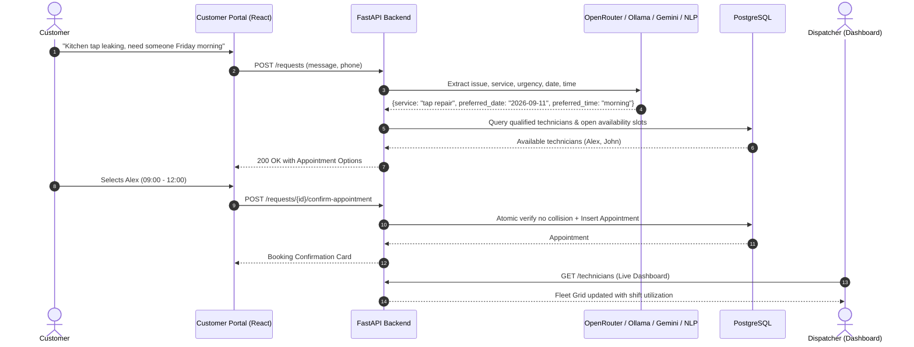

# FlowFix AI — Autonomous Plumbing Dispatch & Operations Platform

[](https://fastapi.tiangolo.com/)
[](https://react.dev/)
[](https://mui.com/)
[](https://vitejs.dev/)
[](https://www.postgresql.org/)
[](https://ollama.ai/)
[](https://openrouter.ai/)
[](https://python.org/)
[](https://pytest.org/)

**FlowFix AI** is an enterprise-grade, full-stack field service management platform that connects an intelligent, conversational customer intake agent with an operations dispatch command center.

It automates emergency trade dispatch by combining natural language extraction, certified skill matching, collision-proof appointment booking, and an autonomous dispatcher copilot.

---

## Key Capabilities

### 1. Conversational Customer Self-Serve Intake
- **Natural Language Diagnosis**: Customers describe plumbing problems in free text (e.g., *"my kitchen mixer tap is dripping constantly"*, *"no hot water coming from the tank"*, or *"water is flooding from a burst pipe"*).
- **Certified Trade Category Resolution**: Normalizes messy customer descriptions into 10 industry-standard plumbing specializations:
  - `tap repair`, `toilet repair`, `shower repair`, `leak investigation`
  - `blocked drains`, `hot water system`, `burst pipe repair`
  - `gas fitting`, `roof plumbing`, `backflow prevention`
- **Deterministic & LLM Date/Time Math**: Resolves relative calendar language (*"tomorrow morning"*, *"day after tomorrow"*, *"Friday 11 Sept"*, *"asap"*, *"first available slot"*) into strict ISO timestamps without hallucinated drift.
- **Loop-Proof Clarification**: When details are missing, asks concise clarification questions and advances smoothly without getting trapped in repetitive prompts.
- **Direct Slot Selection**: Generates certified technician appointment options filtered by specialty and real-time calendar availability.

### 2. Operations Command Center (Dispatcher Portal)
- **Fleet Workload Monitor**: Live capacity indicators showing shift utilization percentages, active job allocations, and license status.
- **Direct Admin Booking on Behalf of Customer**: Dispatchers can inspect any customer service request, view real-time qualified specialist availability, filter by trade capability and shift window (morning / afternoon), and book or reschedule appointments directly from the request drawer with collision protection.
- **Onboard Field Specialists**: Interactive technician registration modal with:
  - Multi-select certified capabilities across all 10 licensed plumbing trade domains.
  - **Automated 35-Day Shift Provisioning**: Automatically seeds 70 morning (`09:00–12:00`) and afternoon (`13:00–17:00`) slots across rolling 5 weeks upon registration.
  - Live grid reload without page refreshes.
- **Calendar & Shift Inspector**: Slide-over drawer detailing confirmed appointments and scheduled shift windows per technician.
- **Request Lifecycle Management**: Filter and review requests through `RECEIVED`, `AWAITING_INFORMATION`, `AWAITING_APPOINTMENT_SELECTION`, and `CONFIRMED`.

### 3. Autonomous Dispatcher Copilot (Agent Studio)
- Natural language operations assistant capable of executing administrative actions:
  - Checking fleet capacity and unassigned workloads.
  - Reallocating emergency appointments.
  - Querying job history and customer details.
  - Powered by cloud models via **OpenRouter** (e.g. `meta-llama/llama-3.3-70b-instruct:free`, `google/gemini-2.0-flash-exp:free`), local LLM (`qwen2.5:3b` via Ollama), or Google Gemini.

### 4. Concurrency & Reliability Hardening
- **Race Condition Prevention**: Prevents double-booking through database constraints and validates appointment slots at commit time.
- **Stale Booking Rejection**: If two customers select the same slot concurrently, the second confirmation is rejected cleanly with an atomic rollback.
- **Client-Side Error Boundaries**: Global React error boundary catches component exceptions gracefully, preventing white-screen crashes.

---

## Architecture & Data Flow



---

## Tech Stack

| Layer | Technologies |
| :--- | :--- |
| **Backend** | **Python 3.11+**, **FastAPI**, **SQLAlchemy 2.0**, **PostgreSQL** (`psycopg3`), **Pydantic v2**, **Alembic** |
| **AI / NLP** | **OpenRouter** (Cloud LLMs), **Ollama** (`qwen2.5:3b`), **Google Gemini** (`google-genai`), Deterministic Weekday/Month Engine |
| **Frontend** | **React 19**, **Vite 8**, **Material-UI v9**, **React Router 7**, Custom Sapphire & Slate Theme |
| **Infrastructure** | **Docker Compose**, JWT Authentication, Role-Based Access Control (`operations`, `admin`) |
| **Testing** | **Pytest 9** (50 unit & integration tests covering NLP, Scheduling, Concurrency, OpenRouter, and Security) |

---

## Project Structure

```text
flowfix-platform/
├── app/                        # FastAPI Backend Application
│   ├── agent/                  # Autonomous Operations Dispatcher Agent
│   ├── api/                    # REST API Endpoints (requests, technicians, admin, auth)
│   ├── auth/                   # JWT Security, Password Hashing, RBAC Dependencies
│   ├── services/               # Core Domain Services (Scheduling, Validation, Confirmation)
│   ├── database.py             # SQLAlchemy Session & Engine Configuration
│   ├── models.py               # Pydantic Schemas & DTOs
│   ├── models_db.py            # SQLAlchemy Declarative Database Models
│   ├── seed_availability.py    # Rolling Shift Availability Seeder
│   ├── seed_services.py        # Plumbing Category Seeder
│   └── seed_technicians.py     # Initial Field Specialist Seeder
├── frontend/                   # React 19 + Material-UI Frontend
│   ├── src/
│   │   ├── components/         # Reusable UI (PageHeader, ErrorBoundary, MarkdownMessage)
│   │   ├── customer/           # Customer Self-Serve Intake Stepper Flow
│   │   ├── pages/              # Dispatcher Dashboard (Overview, Requests, Technicians, Agent)
│   │   ├── services/           # Axios / Fetch API Client
│   │   └── theme/              # Custom MUI Dark Slate & Sapphire Design System
│   └── package.json
├── tests/                      # Automated Test Suite (50 Tests)
│   ├── test_admin_booking.py
│   ├── test_auth_and_admin.py
│   ├── test_confirmation_and_transactions.py
│   ├── test_database_and_customers.py
│   ├── test_extraction_and_nlp.py
│   ├── test_llm.py
│   ├── test_openrouter.py
│   ├── test_scheduling_and_dispatch.py
│   └── test_technicians_and_skills.py
├── alembic/                    # Database Migrations
├── compose.yaml                # PostgreSQL Docker Compose Configuration
├── package.json                # Root proxy scripts (npm run build / dev)
├── requirements.txt            # Python Dependencies
└── .env.example                # Environment Template
```

---

## Quickstart Guide

### 1. Prerequisites
- **Python 3.11+**
- **Node.js 18+** & **npm**
- **Docker & Docker Compose** (for PostgreSQL)
- *(Optional)* **OpenRouter API Key** for cloud LLM inference (free & paid models)
- *(Optional)* **Ollama** running `qwen2.5:3b` for local offline LLM inference

### 2. Clone & Environment Setup
```bash
git clone https://github.com/your-username/flowfix-platform.git
cd flowfix-platform

# Copy environment template
cp .env.example .env
```

### 3. Start PostgreSQL Database
```bash
docker compose up -d
```

### 4. Setup Python Virtual Environment & Install Dependencies
```bash
python3 -m venv .venv
source .venv/bin/activate
pip install -r requirements.txt
```

### 5. Run Migrations & Seed Initial Data
```bash
# Run database schema migrations
alembic upgrade head

# Seed services, demo technicians, and rolling 35-day shift availability (unified single command)
python -m app.seed
```
*(Note: FlowFix also automatically detects a fresh database and seeds services, technicians, and availability on backend startup if unseeded).*

### 6. Start the Backend API
```bash
uvicorn app.main:app --host 127.0.0.1 --port 8000 --reload
```
API Documentation will be available at: **[http://127.0.0.1:8000/docs](http://127.0.0.1:8000/docs)**.

### 7. Start Frontend Dev Server
In another terminal:
```bash
npm run dev
```
The application will launch at: **[http://localhost:5174](http://localhost:5174)**.

---

## Administrator Credentials

The platform includes default administrator credentials:

| Role | Username | Password | Access Level |
| :--- | :--- | :--- | :--- |
| **System Administrator** | `admin` | `change-me-now` | Full Dashboard, Fleet Management, Dispatch Copilot |
| **Customer Portal** | *(Public)* | *(No auth needed)* | Self-serve request booking & schedule selection |

---

## Running Automated Tests

Run the complete test suite:
```bash
pytest tests/ -v
```

Output:
```text
============================= test session starts ==============================
collected 50 items

tests/test_admin_booking.py .........                                    [ 18%]
tests/test_auth_and_admin.py .....                                       [ 28%]
tests/test_confirmation_and_transactions.py ..                           [ 32%]
tests/test_database_and_customers.py ....                                [ 40%]
tests/test_extraction_and_nlp.py .............                           [ 66%]
tests/test_llm.py .                                                      [ 68%]
tests/test_openrouter.py ....                                            [ 76%]
tests/test_scheduling_and_dispatch.py ......                             [ 88%]
tests/test_technicians_and_skills.py ......                              [100%]

======================== 50 passed, 1 warning in 7.79s =========================
```

Verify production frontend build:
```bash
npm run build
```

---

## License
Distributed under the MIT License. See `LICENSE` for details.
